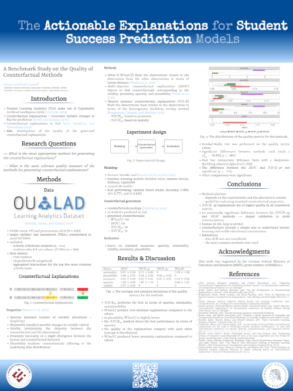

# Poster for the HEXED workshop at EDM 2024 conference

Title: The Actionable Explanations for Student Success Prediction Models

Subtitle: A Benchmark Study on the Quality of Counterfactual Methods

Authors: Mustafa Cavus and Jakub Kuzilek

For the paper codes see: [GitHub](https://github.com/mcavs/HEXED2024_paper)

Citation: TBD

