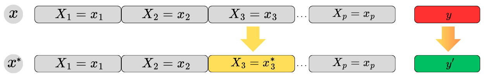
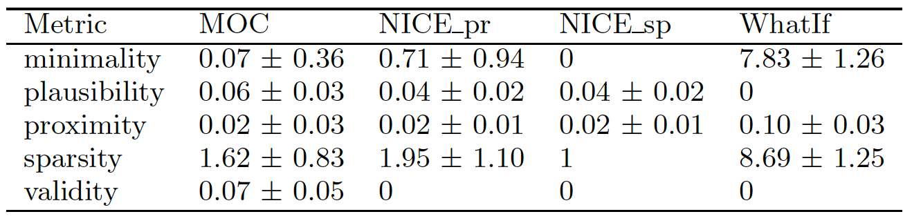
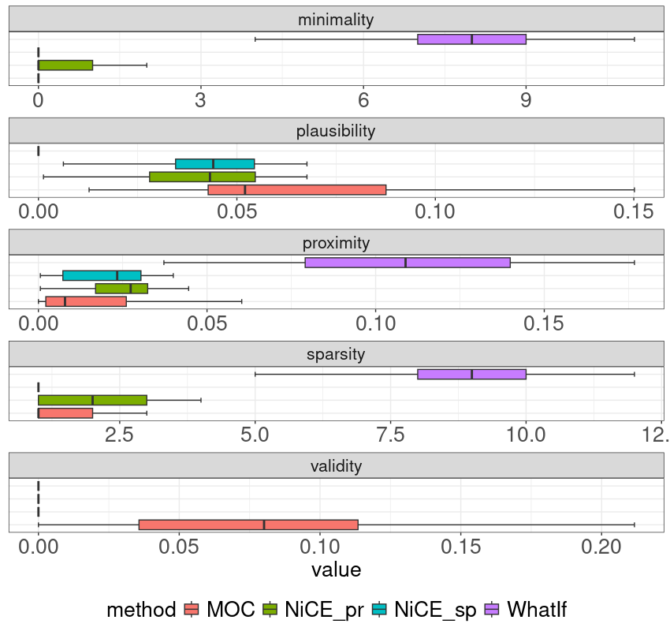

# Introduction

* Trusted Learning Analytics (TLA) make use of Explainable Artificial Intelligence (XAI) [@drachsler2018trusted]
* Counterfactual explanations = necessary variable changes to flip the prediction [@artelt_and_hammer_2019]
* Counterfactual explanations in TLA [@tsiakmaki_et_al_2021, @zhang_et_al_2023, @afrin_et_al_2023]
* **Aim**: Investigation of the quality of the generated counterfactual explanations

# Research Questions
&rarr; *What is the most appropriate method for generating the counterfactual explanations?*

&rarr; *What is the most relevant quality measure of the methods for generating counterfactual explanations?*

# Methods
## Data

![[@kuzilek_et_al_2017]](./oulad.png){width=90%}

* STEM course *FFF* and presentation 2013J (N = 2283)
* target variable: last assessment (TMA5) transformed to *pass*/*fail* labels
* excluded: 
  * actively withdrawn students (n = 675) 
  * students who did not submit all TMAs (n = 500)
* final dataset:
  * 1108 students
  * $14$ predictors ($6$ categorical)
  * aggregated interactions for the top five most common activity types

## Counterfactual Explanations
  

{width=95%}

**Properties** [@warren_et_al_2023]

* *Sparsity* (minimal number of variable alterations = simplicity)
* *Minimality* (smallest possible changes in variable values) 
* *Validity* (minimizing the disparity between the counterfactual and the observation)
* *Proximity* (necessity of a slight divergence between the factual and counterfactual features) 
* *Plausibility* (realistic counterfactuals adhering to the underlying data distribution) 
  
  

**Methods**

* *What-if* ($WhatIf$) finds the observations closest to the observation from the other observations in terms of Gower distance [@wexler_et_al_2019]
* *Multi-objective counterfactual explanations* ($MOC$) objects to find counterfactuals corresponding to the validity, proximity, sparsity, and plausibility [@dandl_et_al_2020] 
* *Nearest instance counterfactual explanations* ($NICE$) finds the observations most similar to the observation in terms of the heterogenous Euclidean overlap method [@brughmans_et_al_2023]
  * $NICE_{pr}$: based on proximity
  * $NICE_{sp}$: based on sparsity

 

## Experiment design

{width=95%}

**Modeling**

* forester AutoML tool [@forester]
* machine learning models: decision trees, random forests, XGBoost, LightGBM
* trained 28 models
* best performing: random forest model (Accuracy $0.900$, AUC $0.771$, and F1 $0.946$)

**Counterfactual generation**

* counterfactuals package [@counterfactuals]
* 12 students predicted as *fail*
* generated counterfactuals: 
  * $WhatIf$: 120
  * $MOC$: 191
  * $NICE_{pr}$: 39
  * $NICE_{sp}$: 19

**Evaluation**

* based on standard measures: sparsity, minimality, validity, proximity, plausibility

# Results & Discussion

{width=100%}

* $NICE_{sp}$ performs the best in terms of sparsity, minimality, and plausibility
* $WhatIf$ produce non-minimal explanations compared to the others
* in plausibility $WhatIf$ is slightly better
* the $NICE_{sp}$ method shows the best performance in terms of sparsity
* the quality of the explanations compete with each other (average & distribution)
* $WhatIf$ produced fewer proximity explanations compared to others

* Kruskal-Wallis test was performed on the quality metric values
* Significant differences between methods rank totals ($\chi_{(4)}^2 = 48.823$, $p < .001$)
* Post hoc comparison Wilcoxon Tests with a Benjamini-Hochberg adjusted alpha level ($.016$)
* The difference between the $MOC$ and $NICE\_{pr}$ not significant $(p = .115)$
* Other comparisons were significant

# Conclusions

* Method selection
  * depends on the requirements and the educational context
  * guided by evaluating standard counterfactual properties
* $NICE\_{sp}$ explanations are of higher quality in all considered metrics
* no statistically significant difference between the $NICE\_{sp}$ and $MOC$ methods &rarr; deeper validation to avoid misconceptions
* human-in-the-loop is needed
* counterfactuals provide a simple way to understand learner learning and enable educational interventions
* limitations: 
  * data drift was not considered
  * the most common methods were used

# Acknowledgments
This work was supported by the German Federal Ministry of Education and Research (BMBF), grant number 16DHBKI045.

# References
