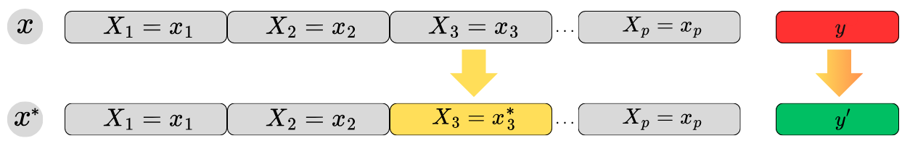
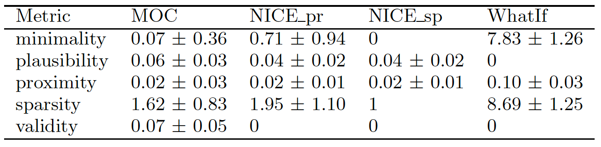
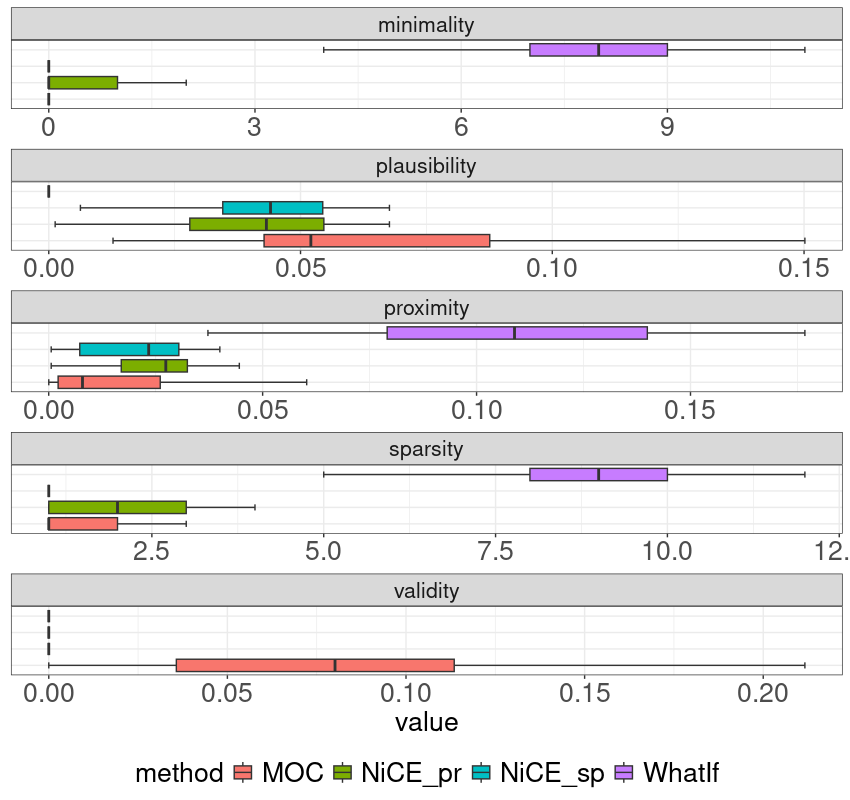

# Introduction
<!-- * feedback is considered essential for supporting successful learning processes and outcomes [@hattie2007power] -->
* Explainable Artificial Intelligence (XAI) unlocks the potential of the black box ML methods for use by Trusted Learning Analytics (TLA) [@drachsler2018trusted]
* Counterfactual explanations are defined as necessary changes of variables to flip the prediction into the intended outcome [@artelt_and_hammer_2019]
* The use of counterfactual explanations in TLA has been explored in several studies [@tsiakmaki_et_al_2021, @zhang_et_al_2023, @afrin_et_al_2023]
* Investigation of the quality of the generated counterfactual explanations
* Using Open University Learning Analytics dataset (OULAD) [@kuzilek_et_al_2017]

# Research Questions
* What is the most appropriate method for generating the counterfactual explanations?
* What is the most relevant quality measure of the methods for generating counterfactual explanations?

# Methods
## Data
* OULAD dataset 
* selected STEM course *FFF* and its presentation 2013J (N = 2283)
* last assessment (TMA5) is target variable for model training
* excluded: 
  * actively withdrawn students (n = 675) 
  * students who did not submit all TMAs (n = 500)
* filtered dataset (N = 1108) consists of $14$ predictors ($6$ categorical, interactions for the top five most common activity types)

## Counterfactual Explanations

* A counterfactual explanation can be briefly defined as the necessary changes in one or more than one variable to flip the model prediction
* Properties [@warren_et_al_2023]: 
  * **Sparsity** advocates for a minimal number of variable alterations, thereby maintaining its simplicity
  * **Minimality** focuses on the smallest possible changes in variable values. 
  * **Validity** is maintained by minimizing the disparity between the counterfactual instance and the observation while ensuring the model output aligns with the desired label 
  * **Proximity** denotes the necessity of a slight divergence between the factual and counterfactual features. 
  * **Plausibility** mandates that counterfactual explanations remain realistic and adhere closely to the underlying data distribution. 
* The counterfactual explanations were generated using the following methods: 
  * **What-if method** (WhatIf) finds the observations closest to the observation from the other observations in terms of Gower distance [@wexler_et_al_2019]
  * **Multi-objective counterfactual explanations method** (MOC) objects to find counterfactuals corresponding to the validity, proximity, sparsity, and plausibility [@dandl_et_al_2020] 
  * **Nearest instance counterfactual explanations method** (NICE) finds the observations most similar to the observation in terms of the heterogenous Euclidean overlap method [@brughmans_et_al_2023]; two objectives: proximity or sparsity

## Experiment design
1. Modeling
  * forester AutoML tool [@forester]
  * 28 models trained with decision trees, random forests, XGBoost, LightGBM methods
  * best performing: random forest model (Accuracy $0.900$, AUC $0.771$, and F1 $0.946$)
2. Counterfactual generation
  * counterfactuals package for generating counterfactual explanations
  * 4 methods: $WhatIf$, $MOC$, $NICE_{pr}$ (NICE based on proximity), $NICE_{sp}$ (NICE based on sparsity)
3. Evaluation
  * 5 quality measures: sparsity, minimality, validity, proximity, plausibility

# Results & Discussion

* The results show that the $NICE_{sp}$ method outperforms the other methods in terms of sparsity, minimality, and plausibility
* The WhatIf method appears to produce explanations that are not minimal compared to the others
*  When the methods are compared in terms of plausibility, it is seen that the WhatIf is better than the others, but the difference is low. While the WhatIf method produced fewer proximity explanations, other methods produced proximity explanations at a similar level
* the $NICE_{sp}$ method shows the best performance in terms of sparsity
* Surprisingly, no method other than the MOC produced non-validity explanation
* the quality of the explanations produced by the methods compete with each other in terms of both average and distribution properties
* Kruskal-Wallis test was performed on the quality metric values
* The differences between the rank totals of the methods were significant, $\chi_{(4)}^2 = 48.823$, $p < .001$. Post hoc comparisons were conducted using Wilcoxon Tests with a Benjamini-Hochberg adjusted alpha level of $.016$. The difference between the MOC and NICE\_pr was no statistically significant $(p = .115)$. The other comparisons were significant.

# Conclusions
* counterfactual explanation methods on the OULAD dataset
* Selection of the most suitable method depends on the stakeholder requirements and the educational context
* selecting the most appropriate methods is generally guided by evaluating standard counterfactual properties: Sparsity, Validity, Proximity, and Plausibility
*  on the OULAD dataset resulted in the finding that explanations generated using the NICE method based on sparsity are of higher quality in terms of all considered metrics than explanations generated through other methods
* no statistically significant difference between the Nearest Instance Counterfactual Explanation and the Multi-Objective Counterfactual Explanations method, which indicates the requirement for the deep validation of generated counterfactual explanations for the at-risk students to avoid misconceptions
* human-in-the-loop is needed even when selecting the most optimal method in technical validation
* the counterfactuals provide a simple way to understand and uncover the issues about learner learning and open the path to recommendations for possible educational interventions
* limitations: data drift was not considered; the most common counterfactual explanation methods were used

# Acknowledgments
This work was supported by the German Federal Ministry of Education and Research (BMBF), grant number 16DHBKI045.

# References
